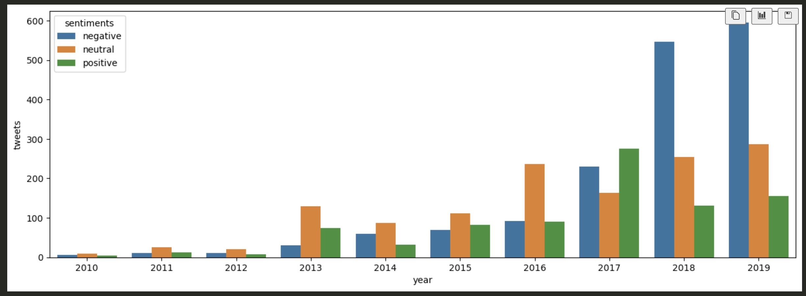
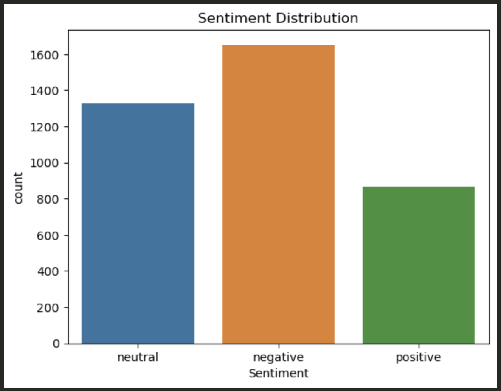
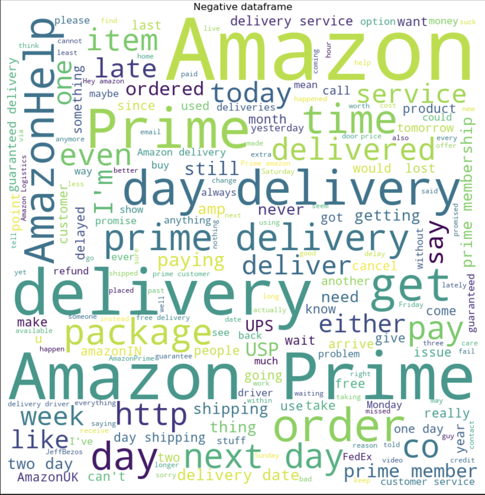
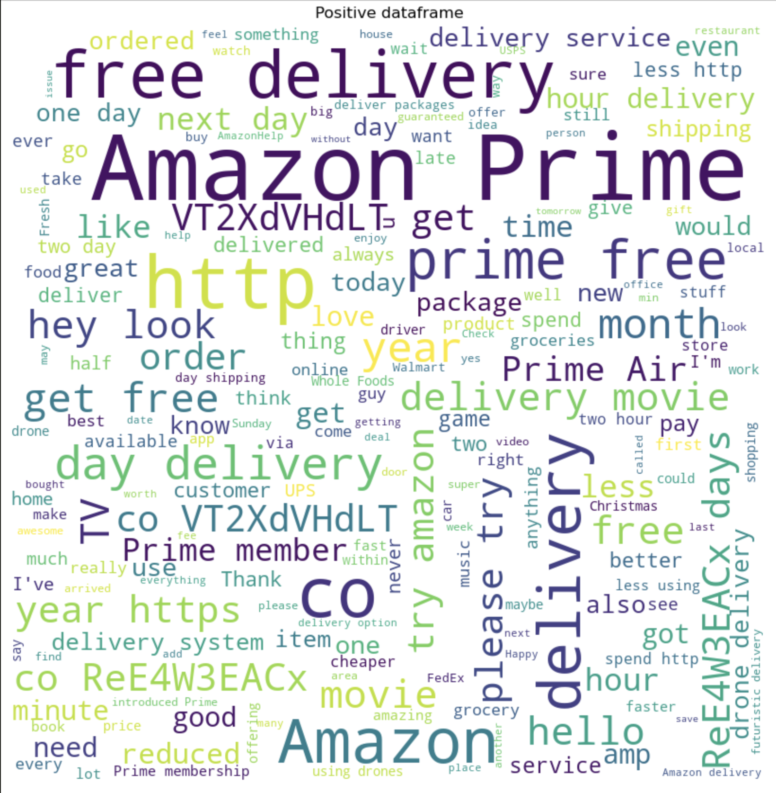

# Amazon delivery sentiment analysis
## Requirements
[AWS account](https://aws.amazon.com/fr/) (or it'll take long time).

run this from your working directory to install required libraries/packages : 
```bash
pip install -r requirements.txt
```
## How I did it.
Using an [ec2 instance](https://aws.amazon.com/fr/ec2/) (to speed up the sentiment analysis process),

c3.8xlarge:

 I used the [snscrape](https://github.com/JustAnotherArchivist/snscrape) library to scrape 5713 tweets (limit for me) from 2010 to 2020, I put them all in a [RDS database](https://aws.amazon.com/fr/rds/) and I pre-processed all these tweets (filter spam) using this pre-trained [model](https://huggingface.co/mrm8488/bert-tiny-finetuned-sms-spam-detection) (I know it's an SMS and not tweets spam detector but I ran a lot of tests and it turned out to be the more accurate).

Then, with the spam tweets gone, I began the sentiment analysis with this pre-trained [model](https://huggingface.co/cardiffnlp/twitter-roberta-base-sentiment-latest), 
## Results
### Bar plot of number of tweets by sentiment over time

### Sentiment distribution

### Wordclouds



## What to conclude from that ?

### Note that I am not a data scientist or analyst, I am just a student who loves trying things out.
From these results, we can see that, the part of negative tweets increase significantly over the years, and the part of positive tweets is decreasing since 2017. We could say that the general opinion seems to get worse and worse over time. But these statistics could be biased due to spam/sentiment prediction algorithm, it is not enough to make serious conclusions.
Moreover, rare are the persons who tweet nice things on Twitter, it is more likely to see people complaining about the delivery than seeing people praising Amazon for their fast delivery, it is the human nature.
